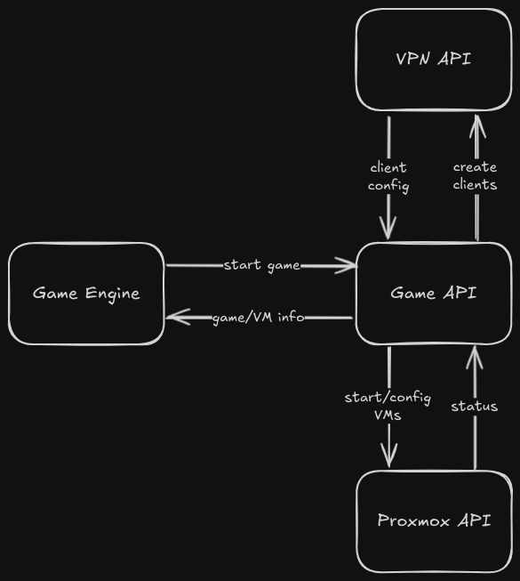

## Concept
Here you can see how the different APIs are structured and how they interact with each other.

## Endpoint
Here are all the different API Endpoints listed.

### VPN API
| Endpoint           | Method | Description                                                                                    | Response                                                        |
| ------------------ | ------ | ---------------------------------------------------------------------------------------------- | --------------------------------------------------------------- |
| `/generate-client` | POST   | Performs all necessary actions to create a new client and returns the OVPN configuration file. | `{"client_name": [client_name], "ovpn_config": [ovpn_content]}` |
| `/remove-client`   | POST   | Revokes the client certificate and removes all the client configurations.                      | `{"message": f"Client {client_name} removed successfully"}`     |
