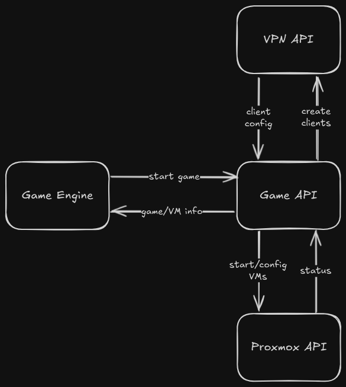

The VPN-Server is a virtual machine running on Proxmox.
It should neable the players to connect to the game server via a VPN connection.

## Core Features
- OpenVPN Server
- VPN Client creation (via API)
- VPN Client revocation (via API)
- Limit Player Access in Proxmox Network (via dynamic iptable rules)


## Concepts

These Concepts Explain where the VPN-Server is placed in the Proxmox Network and how it operates.

### Proxmox Network
The VPN-Server is Placed in the Proxmox Network inside the 
Management Services Network (`10.1.1.0/24`) with the IP `10.1.1.10`.

For the VPN-Server, the Proxmox is configured with the following three port forwarding rules:
- SSH 2210:22 (TCP)
- OpenVPN 1194:1194 (TCP/UDP)
- VPN-API 5000:5000 (TCP)


The figure describes how the Proxmox Network looks like and where the VPN-Server is placed.

### Workflow Client Creation/Revocation

**Creation:**
- Request to create a new VPN Client
- Generate new client certificates on OpenVPN
- Create a new client network config file (IP + routes of client)
- Generate the ovpn config file for the client
- Create IP table rules for the game (if not already created)
- Return the ovpn config file

**Revocation:**
- Request to revoke a VPN Client
- Revoke the client certificate on OpenVPN
- Delete the client network config file
- Remove the IP table rules for the game (if not already deleted)


### API Concept



The figure describes how the different APIs are connected to each other.
This VPN API gets called by the Game API to generate VPN Clients for a new Game
or remove them when the game is deleted. The Game API gets called by the Game Engine.


## How to Setup

The whole VPN-Server is setup via a script. It installs OpenVPN and the API service.

```
git clone https://github.com/H4ckwars/VPN-Server.git
cd VPN-Server
chmod +x VPN-setup.sh
./VPN-setup.sh
```


The API Service can then be inspected via Systemd
```
sudo systemctl status vpn-api
```